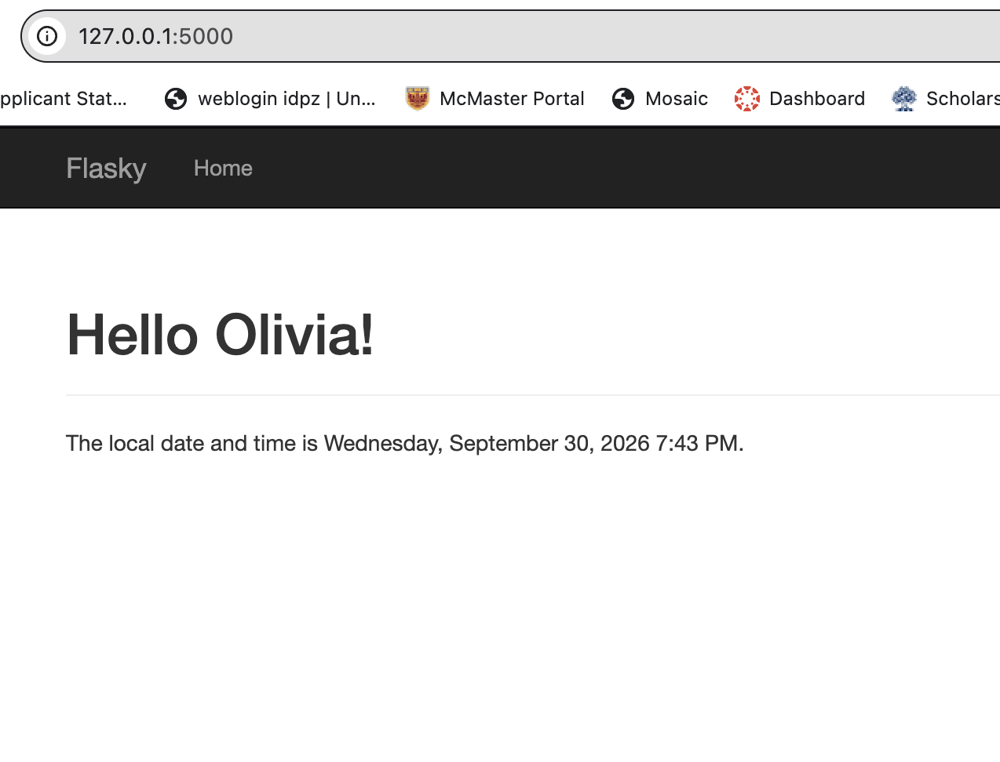
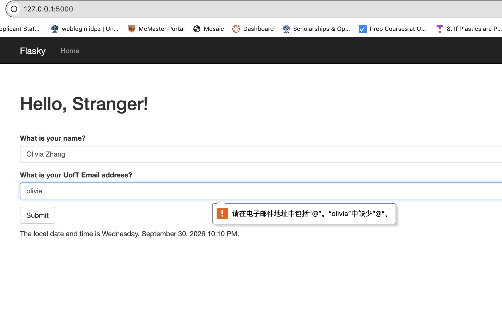
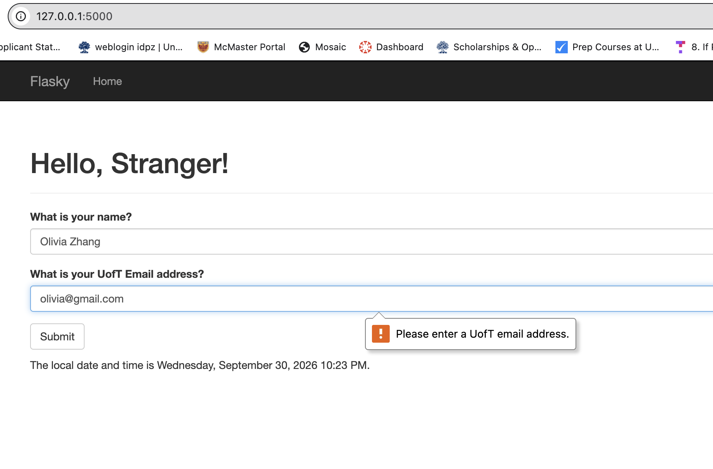
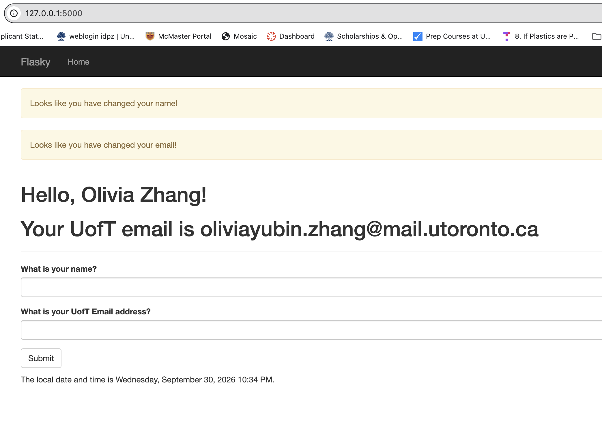

# E444-F2026-PRA3

**Author:** Olivia Zhang

This repository is a clone of https://github.com/miguelgrinberg/flasky

## Activity 1.3 — Templates and Timestamp

The page includes a navigation bar, a personalized greeting,
and a timestamp displayed in `LLLL` format.



## Activity 1.4 — Email Validation

The form validates email syntax and requires the address to contain
`utoronto`. Invalid input displays a browser validation message.
Valid submissions save the user's name and email in the session and
display them as headings. Changing a previously saved name or email
displays a notification.

### Email Missing @


### Non-UofT Email


### Valid Submission


## Activity 2.4 — Docker

The application runs in a Docker container using the dependencies
listed in `requirements.txt` and the configuration in `Dockerfile`.

### Build the Image

Run from the repository root:

```bash
docker build -t e444-pra3 .
```

### Run the Container

```bash
docker run -d --name pra3-flask -p 5001:5001 e444-pra3
```

Open http://localhost:5001.

Both the host and container use port 5001 because port 5000
is occupied by macOS Control Center on the development machine.

### Check Status and Logs

```bash
docker ps -a
docker logs pra3-flask
```

### Stop and Restart the Container

```bash
docker stop pra3-flask
docker start pra3-flask
```